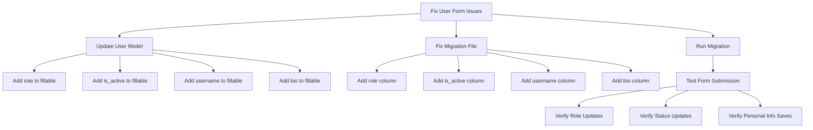

# User Form Fixes Plan

## Issues Identified

### 1. Personal Information Form Not Saving
- **Problem**: The `username` and `bio` fields in the Personal Information section are not being saved
- **Root Cause**: These fields are missing from the `$fillable` array in the User model
- **Location**: [`app/Models/User.php`](app/Models/User.php:20)

### 2. Access & Role Not Updating
- **Problem**: The role selection (Admin/User) is not updating when the form is submitted
- **Root Cause**: The `role` field is missing from the `$fillable` array in the User model
- **Location**: [`app/Models/User.php`](app/Models/User.php:20)

### 3. Account Status Not Updating
- **Problem**: The account status toggle (Active/Inactive) is not updating when the form is submitted
- **Root Cause**: The `is_active` field is missing from the `$fillable` array in the User model
- **Location**: [`app/Models/User.php`](app/Models/User.php:20)

### 4. Incomplete Migration File
- **Problem**: The migration file [`2026_01_24_082528_add_roles_and_profile_fields_to_users_table.php`](database/migrations/2026_01_24_082528_add_roles_and_profile_fields_to_users_table.php:1) is incomplete
- **Current State**: Only adds `last_login_at` column
- **Expected State**: Should also add `role`, `is_active`, `username`, and `bio` columns based on the filename

## Solution Plan



## Implementation Steps

### Step 1: Update User Model
**File**: [`app/Models/User.php`](app/Models/User.php:20)

Update the `$fillable` array to include all missing fields:

```php
protected $fillable = [
    'name',
    'email',
    'password',
    'avatar',
    'role',           // Add this
    'is_active',      // Add this
    'username',       // Add this
    'bio',            // Add this
];
```

### Step 2: Fix Migration File
**File**: [`database/migrations/2026_01_24_082528_add_roles_and_profile_fields_to_users_table.php`](database/migrations/2026_01_24_082528_add_roles_and_profile_fields_to_users_table.php:1)

Update the `up()` method to add all missing columns:

```php
public function up(): void
{
    Schema::table('users', function (Blueprint $table) {
        if (!Schema::hasColumn('users', 'role')) {
            $table->string('role')->default('user')->after('email');
        }
        if (!Schema::hasColumn('users', 'is_active')) {
            $table->boolean('is_active')->default(true)->after('role');
        }
        if (!Schema::hasColumn('users', 'username')) {
            $table->string('username')->nullable()->unique()->after('is_active');
        }
        if (!Schema::hasColumn('users', 'bio')) {
            $table->text('bio')->nullable()->after('username');
        }
        if (!Schema::hasColumn('users', 'last_login_at')) {
            $table->timestamp('last_login_at')->nullable()->after('bio');
        }
    });
}
```

Update the `down()` method to drop all columns:

```php
public function down(): void
{
    Schema::table('users', function (Blueprint $table) {
        $table->dropColumn(['role', 'is_active', 'username', 'bio', 'last_login_at']);
    });
}
```

### Step 3: Run Migration
Execute the migration to update the database schema:

```bash
php artisan migrate
```

### Step 4: Test the Fixes
Verify that all issues are resolved:

1. **Personal Information**: Create/edit a user and verify that `username` and `bio` are saved
2. **Access & Role**: Change a user's role and verify it updates correctly
3. **Account Status**: Toggle the account status and verify it updates correctly

## Notes

- The UserController already has the correct validation and update logic for these fields
- The form blade template is correctly structured with all necessary inputs
- The User model already has the `is_active` cast to boolean, which is correct
- The `isAdmin()` and `isActive()` methods in the User model will work correctly once the fields are fillable

## Files to Modify

1. [`app/Models/User.php`](app/Models/User.php:1) - Update `$fillable` array
2. [`database/migrations/2026_01_24_082528_add_roles_and_profile_fields_to_users_table.php`](database/migrations/2026_01_24_082528_add_roles_and_profile_fields_to_users_table.php:1) - Add missing columns
